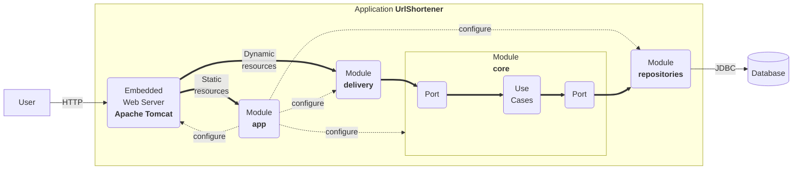

# Getting Started with the URL Shortener project

2024-08-31

## System requirements

This application leverages cutting-edge technologies to deliver a robust
and versatile user experience:

1.  **Programming Language**: The application is written in [Kotlin
    2.0.20](https://kotlinlang.org/), a versatile, open-source,
    statically-typed language. Kotlin is renowned for its adaptability
    and is commonly used for Android mobile app development. Beyond
    that, it finds application in server-side development, making it a
    versatile choice.

2.  **Build System**: The application utilizes [Gradle
    8.5](https://gradle.org/) as its build system. Gradle is renowned
    for its flexibility in automating the software building process.
    This build automation tool streamlines tasks such as compiling,
    linking, and packaging code, ensuring consistency and reliability
    throughout development.

3.  **Framework**: The application employs [Spring Boot
    3.3.3](https://docs.spring.io/spring-boot/) as a framework. This
    technology requires Java 17 and is fully compatible up to and
    including Java 21. Spring Boot simplifies the creation of
    production-grade [Spring-based applications](https://spring.io/). It
    adopts a highly opinionated approach to the Spring platform and
    third-party libraries, enabling developers to initiate projects with
    minimal hassle.

## Overall structure

The structure of this project is heavily influenced by [the clean
architecture](https://blog.cleancoder.com/uncle-bob/2012/08/13/the-clean-architecture.html):

- A `core` module where we define the domain entities and the
  functionalities (also known as use cases, business rules, etc.). They
  do not know that this application has a web interface or that data is
  stored in relational databases.
- A `repositories` module that knows how to store domain entities in a
  relational database.
- A `delivery` module that knows how to expose the functionalities on
  the web.
- An `app` module that contains the main application, the configuration
  (i.e., it links `core`, `delivery`, and `repositories`), and the
  static assets (i.e., HTML files, JavaScript files, etc.).



Usually, if you plan to add a new feature:

- You will add a new use case to the `core` module.
- If required, you will modify the persistence model in the
  `repositories` module.
- You will implement a web-oriented solution to expose it to clients in
  the `delivery` module.

Sometimes, your feature will not be as simple, and it may require:

- Connecting to a third party (e.g., an external server). In this case,
  you will add a new module named `gateway` responsible for such a task.
- An additional application. In this case, you can create a new
  application module (e.g., `app2`) with the appropriate configuration
  to run this second server.

Features that require connecting to a third party or having more than a
single app will be rewarded.

## Run

The application can be run as follows:

``` bash
./gradlew bootRun
```

Now you have a shortener service running at port 8080. You can test that
it works as follows:

``` bash
$ curl -v -d "url=http://www.unizar.es/" http://localhost:8080/api/link
*   Trying ::1:8080...
* Connected to localhost (::1) port 8080 (#0)
> POST /api/link HTTP/1.1
> Host: localhost:8080
> User-Agent: curl/7.71.1
> Accept: */*
> Content-Length: 25
> Content-Type: application/x-www-form-urlencoded
> 
* upload completely sent off: 25 out of 25 bytes
* Mark bundle as not supporting multiuse
< HTTP/1.1 201 
< Location: http://localhost:8080/tiny-6bb9db44
< Content-Type: application/json
< Transfer-Encoding: chunked
< Date: Tue, 28 Sep 2021 17:06:01 GMT
< 
* Connection #0 to host localhost left intact
{"url":"http://localhost:8080/tiny-6bb9db44","properties":{"safe":true}}%   
```

And now, we can navigate to the shortened URL.

``` bash
$ curl -v http://localhost:8080/6bb9db44
*   Trying ::1:8080...
* Connected to localhost (::1) port 8080 (#0)
> GET /tiny-6bb9db44 HTTP/1.1
> Host: localhost:8080
> User-Agent: curl/7.71.1
> Accept: */*
> 
* Mark bundle as not supporting multiuse
< HTTP/1.1 307 
< Location: http://www.unizar.es/
< Content-Length: 0
< Date: Tue, 28 Sep 2021 17:07:34 GMT
< 
* Connection #0 to host localhost left intact
```

## Build and Run

The uberjar can be built and then run with:

``` bash
./gradlew build
java -jar app/build/libs/app-0.2024.1-SNAPSHOT.jar
```

## Functionalities

The project offers a minimum set of functionalities:

- **Create a short URL**. See in `core` the use case
  `CreateShortUrlUseCase` and in `delivery` the REST controller
  `UrlShortenerController`.

- **Redirect to a URL**. See in `core` the use case `RedirectUseCase`
  and in `delivery` the REST controller `UrlShortenerController`.

- **Log redirects**. See in `core` the use case `LogClickUseCase` and in
  `delivery` the REST controller `UrlShortenerController`.

The objects in the domain are:

- `ShortUrl`: the minimum information about a short URL
- `Redirection`: the remote URI and the redirection mode
- `ShortUrlProperties`: a handy way to extend data about a short URL
- `Click`: the minimum data captured when a redirection is logged
- `ClickProperties`: a handy way to extend data about a click

## Delivery

The above functionality is available through a simple API:

- `POST /api/link` which creates a short URL from data send by a form.
- `GET /{id}` where `{id}` identifies the short URL, deals with
  redirects, and logs use (i.e. clicks).

In addition, `GET /` returns the landing page of the system.

## Repositories

All the data is stored in a relational database. There are only two
tables.

- **shorturl** that represents short URLs and encodes in each row
  `ShortUrl` related data,
- **click** that represents clicks and encodes in each row `Click`
  related data.

## Reference Documentation

For further reference, please consider the following sections:

- [Official Gradle documentation](https://docs.gradle.org)
- [Spring Boot Gradle Plugin Reference
  Guide](https://docs.spring.io/spring-boot/docs/current/gradle-plugin/reference/htmlsingle/)
- [Spring
  Web](https://docs.spring.io/spring-boot/reference/web/index.html)
- [Spring SQL
  Databases](https://docs.spring.io/spring-boot/reference/data/sql.html)

## Guides

The following guides illustrate how to use some features concretely:

- [Building a RESTful Web
  Service](https://spring.io/guides/gs/rest-service/)
- [Serving Web Content with Spring
  MVC](https://spring.io/guides/gs/serving-web-content/)
- [Building REST services with
  Spring](https://spring.io/guides/tutorials/rest/)
- [Accessing Data with
  JPA](https://spring.io/guides/gs/accessing-data-jpa/)

# Project Report ElectricURL
## QR Code Generation
### Description
Generate a QR code for any shortened URL, offering an alternative access method.
### Libraries
### How to run the PoC
When you write a URL in the input field and click on the shorten button, the QR is automatically generated below the shortened url.
### Tests
We have implemented 3 tests: the first one tests that with a valid shortened URL and a valid size a QR is generated.
The second one tests that with an invalid URL (for example an empty one) the create function throws an exception.
The last one is similar to the second one but with a null shortened URL.

## Browser and Platform Identification
### Description
Analyze HTTP headers to identify the browser (e.g., Chrome, Firefox) and platform (e.g., Windows, macOS, Linux) used during redirection requests.
### Libraries
We have used ua-parser library to parser the User-Agent header from the requests and obtain the browser and the platform.
It is a JavaScript library to detect Browser, Engine, OS, CPU, and Device type/model from User-Agent data with relatively small footprint (~17KB minified, ~6KB gzipped) that can be used either in browser (client-side) or node.js (server-side).
### How to run the PoC
When you click on the shortened URL generated, the user-agent header is parsed to obtain the browser and the platform and these values are put in the ClickProperties when the click is going to be saved.
### Tests
We have implemented 3 tests: the first one tests that with a valid user agent are the corresponding ones.
The second one tests that with an invalid user agent (for example an empty one) the parse function throws an exception. 
The last one tests that if the parse function returns null values the browser and the platform are the default values.

## Geolocation Service
### Description
Provide the client’s geographical location based on their IP address. This is useful for tracking both the user requesting a redirection and the user who clicked the shortened URL.
### Libraries
### Challenges
### How to run the PoC
Both when a get and a post are performed, the remoteAddr is obtained, from which the ip and the country are obtained and these values are put in the ClickProperties when the click is going to be saved or when the ShortUrlProperties ar going to be created.
### Tests
We have implemented 3 tests: the first one tests that with a valid user agent are the corresponding ones.
The second one tests that with an invalid user agent (for example an empty one) the parse function throws an exception.
The last one tests that if the parse function returns null values the browser and the platform are the default values.

## URL Accessibility Check
### Description
Ensure that a URL is reachable before allowing it to be shortened.
### Libraries
### Challenges
### How to run the PoC
Before an url is shortened, it is checked by a get request to see if it is reachable. If it is not, it returns an error and is not shortened.
### Tests

## Google Safe Browsing Check
### Description
Validate the safety of a URL using the Google Safe Browsing API, ensuring users are not redirected to malicious sites.
### Libraries
### Challenges
### How to run the PoC
### Tests

## CSV Upload
### Description
Enable users to upload a CSV of URLs to shorten, and return a CSV of shortened URLs.
### Libraries
### Challenges
### How to run the PoC
You have to click on the button on the left of the input field that has a paper clip icon and attach a .csv file. As a result, a .csv file will be automatically downloaded with both the original urls and the shortened urls.
### Tests

## Redirection Limits
### Description
Set limits on redirections, such as a maximum number of redirects over a set time or concurrent redirects for a URL or domain.
### Libraries
### Challenges
### How to run the PoC
The redirection limit is 10. If you click 10 times the same shortened URL, an error will show.
### Tests